# AI Learning Path: Voice Cloning Pipeline (GitHub-Friendly)

This mindmap renders directly on GitHub using Mermaid diagrams.

---

## 🗺️ Complete Learning Mindmap

```mermaid
%%{init: {'theme':'base', 'themeVariables': { 'primaryColor':'#4a90e2', 'primaryTextColor':'#fff', 'primaryBorderColor':'#2e5c8a', 'lineColor':'#6c757d', 'secondaryColor':'#50C878', 'tertiaryColor':'#FFB347', 'fontSize':'14px'}}}%%
mindmap
  root((AI Learning Path))
    Foundation
      Environment Setup
        Virtual Environments
        Python 3.9+
        PyTorch CUDA
        GPU Setup
        Jupyter
      Python Programming
        File I/O
        Text Processing
        Audio Handling
        Scripting
        Best Practices
    Core ML
      Deep Learning Basics
        PyTorch Foundations
          Tensors
          Device Management
          Autograd
        Neural Networks
          Perceptrons
          Activations
          Forward Pass
          Backpropagation
        Key Concepts
          Loss Functions
          Optimizers
          Regularization
          Normalization
        Training Process
          Training Loop
          Epochs & Batches
          Validation
        Labs 01-09
          Logistic Regression
          Hidden Layers
          L-Layered Networks
          DNN Application
          Initialization
          Regularization
          Gradient Checking
          Optimization
          TensorFlow
        Hyperparameter Tuning
          Train/Dev/Test
          Bias vs Variance
          Learning Curves
          Dropout
          Batch Norm
    Domain AI
      NLP
        Tokenization
          Word-level
          Subword BPE
          Character-level
        NLP Tasks
          NER
          Sentiment Analysis
          Summarization
        Text for TTS
          Dialogue Detection
          Text Cleaning
      Audio Processing
        Audio Fundamentals
          Sampling Rate
          Bit Depth
          Mono vs Stereo
        Feature Extraction
          Waveforms
          Spectrograms
          Mel-Spectrograms
          MFCCs
        Processing
          Normalization
          Resampling
          Noise Reduction
      Transformers
        Architecture
          Self-Attention
          Multi-head Attention
          Positional Encoding
        Model Types
          BERT
          GPT
          T5/BART
        HuggingFace
          Model Hub
          Pipeline API
          Fine-tuning
      TTS Systems
        TTS Pipeline
          Text Analysis
          G2P Conversion
          Prosody
          Synthesis
        Architectures
          Tacotron 2
          FastSpeech
          XTTS
          Bark
        Voice Cloning
          Few-shot
          Zero-shot
          Fine-tuning
      Generative AI
        Model Types
          GANs
          VAEs
          Transformers
        Text Generation
          GPT-2/3
          Prompt Engineering
          Sampling
        Applications
          Summaries
          Dialogue
          Style Transfer
    Data Engineering
      Data Preparation
        Collection
          Recording
          Quality Check
        Organization
          Dataset Structure
          Metadata
        Preprocessing
          Silence Trim
          Normalization
          Resampling
        Quality Control
          Validation
          Metrics
        Public Datasets
          LibriTTS
          LJSpeech
          VCTK
      Training & Fine-tuning
        Training Setup
          GPU Config
          Memory Mgmt
          Multi-GPU
        Process
          Data Loading
          Architecture
          Loss Functions
          Optimizers
        Hyperparameters
          Batch Size
          Learning Rate
          Epochs
          Mel Bins
        Monitoring
          Loss Curves
          Samples
          Checkpoints
        Strategies
          Transfer Learning
          Layer Freezing
          Adaptation
    Production
      MLOps
        API Development
          FastAPI
          Endpoints
          Error Handling
        Model Serving
          Loading
          Optimization
          Caching
        Containerization
          Docker
          Images
          Orchestration
        Monitoring
          Logging
          Metrics
          Alerts
        Versioning
          Model Registry
          A/B Testing
          CI/CD
      Cloud Platforms
        Providers
          AWS
          GCP
          Azure
        Compute
          VMs
          GPU Instances
          Auto-scaling
        Storage
          S3
          Cloud Storage
          Backups
        Serverless
          Lambda
          Cloud Functions
        Architecture
          Load Balancing
          CDN
          Monitoring
    Integration
      Project Building
        Architecture
          Components
          Interfaces
          Data Flow
        Modules
          Text Processor
          TTS Integration
          Post-processing
        Orchestration
          Chaining
          Error Handling
          Logging
        Interfaces
          CLI
          Web API
          Batch
        Testing
          Unit Tests
          Integration
          E2E
      Capstone
        Week 1: Data Collection
        Week 2: Preparation
        Weeks 3-4: Training
        Week 5: Integration
        Week 6: Deployment
        Week 7: Documentation
    Advanced
      DL Advanced
        Historical
          Hinton's Work
          Backprop
          Dropout
        Architectures
          ResNets
          Attention
          ViT
        Optimization
          Batch Norm
          Gradient Clip
          Mixed Precision
        Emerging
          Self-supervised
          Few-shot
          Meta-learning
      Extensions
        Multi-lingual TTS
        Emotion Control
        Real-time Systems
        Accessibility
    Professional
      Research
        Reading Papers
        Experiments
        Writing
      Collaboration
        Git
        Code Review
        Communication
      Ethics
        Voice Cloning Ethics
        Deepfakes
        Privacy
        Responsible AI
```

---

## 📊 Alternative View: Hierarchical Structure

For a more detailed breakdown, see the sections below or view the [interactive HTML version](ai_learning_mindmap.html).

### 1️⃣ Foundation Layer (Weeks 1-2)
- **Module 00**: Environment Setup
- **Module 01**: Python Programming

### 2️⃣ Core Machine Learning (Weeks 3-5)
- **Module 02**: Deep Learning Basics (9 labs + comprehensive docs)

### 3️⃣ Domain-Specific AI (Weeks 6-11)
- **Module 05**: NLP Fundamentals
- **Module 04**: Speech & Audio Processing  
- **Module 06**: Hugging Face Transformers
- **Module 03**: TTS Systems
- **Module 09**: Generative AI

### 4️⃣ Data Engineering (Weeks 12-17)
- **Module 07**: Data Preparation
- **Module 08**: Model Training & Fine-tuning

### 5️⃣ Production & Deployment (Weeks 18-20)
- **Module 10**: MLOps
- **Module 11**: Cloud Platforms

### 6️⃣ Integration & Projects (Weeks 21-25)
- **Module 12**: Project Building
- **Capstone**: Voice Replication Pipeline

### 7️⃣ Advanced Topics
- Deep Learning Advanced Concepts
- Domain Extensions

### 8️⃣ Professional Skills
- Research & Documentation
- Collaboration
- Ethics & Responsibility

---

## 🎯 Quick Navigation

- **[Choose Your Learning Path](LEARNING_PATHS.md)** - 5 paths for different backgrounds
- **[Interactive Mindmap](ai_learning_mindmap.html)** - Full interactive version (open in browser)
- **[Detailed Structure](AI_LEARNING_MINDMAP.md)** - Markdown outline with all details
- **[Implementation Guide](IMPLEMENTATION_GUIDE.md)** - How to use these resources

---

## 💡 Viewing Options

### On GitHub:
✅ The Mermaid diagram above renders automatically

### Locally:
- Open [ai_learning_mindmap.html](ai_learning_mindmap.html) in your browser for an interactive, zoomable version
- The HTML version has color-coding, expand/collapse, and better navigation

### GitHub Pages (Optional):
You can also enable GitHub Pages to host the interactive HTML version:
1. Go to repository Settings → Pages
2. Select source branch (main)
3. Access at: `https://yourusername.github.io/voice-cloning-pipeline/ai_mind_map/ai_learning_mindmap.html`

---

**The mindmap visualizes the complete learning journey from AI foundations to production voice cloning systems!** 🚀
